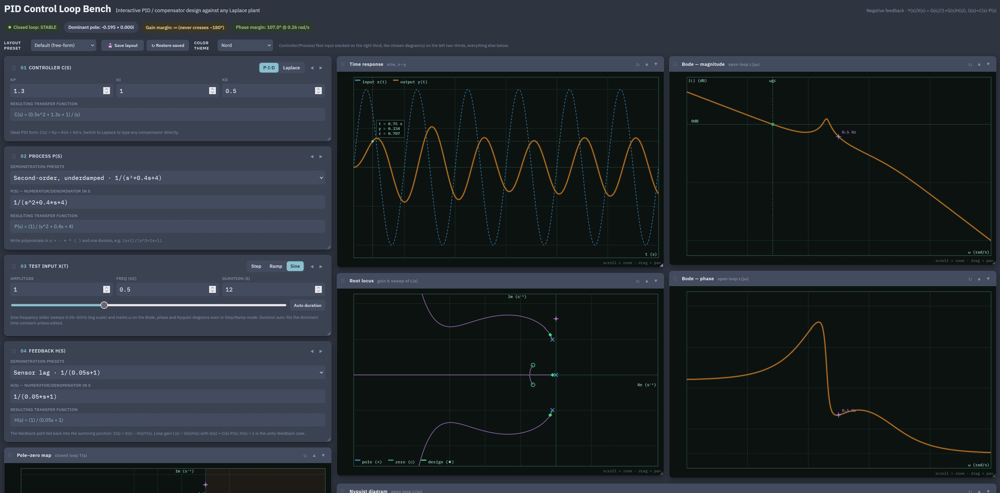

# PID Control Loop Bench

A single-page, client-side control-systems workbench: design a PID or arbitrary
Laplace-domain compensator, run it against any plant transfer function and any
feedback path, and see step/ramp/sine response, Bode magnitude/phase, Nyquist,
root locus, and a pole-zero map update live — with pan/zoom, rearrangeable
panels, and one-click layout presets.

Everything lives in **one HTML file** (`loop-bench.html`). There is no server,
no build step, and no network dependency beyond loading the two Google Fonts
(IBM Plex Sans / IBM Plex Mono) — the page works fine offline once fonts are
cached, and still functions (with fallback system fonts) with no network at all.

## LIVE demo

[PID Control Loop Bench](https://jurgenkobierczynski.com/PIDControlLoopBench/loop-bench.html)

## Screenshot

## Made with Claude

Made using Claude Sonnet 5 High

## Is the math actually happening in real time?

Yes. Every keystroke or control change (Kp/Ki/Kd, a Laplace expression, the
plant preset, the test signal, dragging a slider) fires a single JS function,
`computeAll()`, which re-parses both transfer functions from scratch and
re-runs the *entire* pipeline — root finding, state-space simulation, the
320-point frequency sweep, and the root-locus gain sweep — synchronously, in
the browser, before repainting all six canvases. There's no server round-trip,
no caching of "unchanged" results, and no debounce hiding latency: it's cheap
enough (a few milliseconds for typical system orders) to just redo it all,
every time. Panning/zooming a chart skips the recompute and only re-draws
from the last computed result, via a separate `redrawAll()` path, so dragging
stays smooth even though editing a field re-derives everything.

## Math and algorithms used

No math, plotting, or charting library is used anywhere — no math.js,
numeric.js, Chart.js, D3, Plotly, etc. Everything below is hand-written
vanilla JavaScript in the `<script>` block, operating on plain arrays and
`[re, im]` pairs.

- **Complex arithmetic** — a minimal set of functions (`cAdd`, `cSub`, `cMul`,
  `cDiv`, `cAbs`, `cArg`, `cScale`) operating on 2-element `[re, im]` arrays.
- **Polynomials** — represented as plain arrays of real coefficients in
  descending power order. `polyAdd`, `polyScale`, `polyMul` (convolution),
  and `polyTrim` implement the algebra needed to multiply/add transfer
  functions: the forward path `G = C·P`, the loop gain `L = G·H`, and the
  closed loop `Y/X = G/(1+GH)` (which numerically is `T.num = G.num·H.den`,
  `T.den = G.den·H.den + G.num·H.num` — this collapses back to the familiar
  `T = L/(1+L)` exactly when `H(s) = 1`).
- **Laplace expression parser** — a small hand-written tokenizer plus a
  recursive-descent parser (grammar: expression → term → unary → power →
  atom) that turns text like `(s+1)/(s^2+2s+1)` directly into two polynomial
  coefficient arrays. It supports `+ - * ^ ( )`, implicit multiplication
  (`2s`, `(s+1)(s+2)`), and exactly one top-level `/` to split
  numerator/denominator. There is no symbolic engine underneath — it builds
  the coefficient arrays as it parses.
- **Root finding** — the **Durand–Kerner (Weierstrass) method**, a
  simultaneous-iteration algorithm that finds *all* complex roots of a
  polynomial at once from a fixed set of spread-out initial guesses. Used for
  open- and closed-loop poles/zeros, and re-run at every one of the ~90 gain
  steps in the root locus sweep. Capped at degree 12 for numerical
  reliability.
- **State-space simulation** — the closed-loop `T(s)` is converted to
  **controllable canonical form** (A, B, C, D matrices) and integrated with a
  classic 4th-order **Runge–Kutta (RK4)** stepper to produce the step/ramp/sine
  time response, with the step count scaled to the simulated duration.
- **Frequency response** — `L(jω)` is evaluated directly via Horner's method
  in complex arithmetic over a 320-point logarithmically spaced sweep from
  0.01 to 1000 rad/s, feeding the Bode magnitude/phase and Nyquist plots.
- **Phase unwrapping** — a standard cumulative ±360° correction pass so the
  Bode phase curve is continuous instead of wrapping at ±180°.
- **Gain/phase margins** — found by scanning the swept frequency arrays for
  the first sign change across 0 dB and −180° and linearly interpolating
  between the bracketing samples.
- **Root-locus branch continuity** — the Durand–Kerner solver returns an
  *unordered* set of roots at every gain step, so a greedy nearest-neighbor
  match against the previous step's roots is used to stitch them into
  continuous branches for drawing.
- **Rendering** — all six panels are hand-drawn on `<canvas>` 2D contexts:
  axis/grid drawing, log and linear scales, equal-aspect complex-plane
  scaling for Nyquist/root-locus/pole-zero, and the pan/zoom/reset
  interaction (wheel-to-zoom anchored at the cursor, drag-to-pan, per-panel
  view state) are all custom, not a charting library feature.
- **Root-locus refinement** — after the initial log-spaced gain sweep, the
  gain axis is adaptively bisected wherever consecutive samples on any
  branch land too far apart in the complex plane (e.g. near a breakaway/
  break-in point), re-solving and inserting extra points only where needed
  so those curves render smoothly instead of as a coarse jump. The view's
  auto-scale is computed once from the *pre-refinement* sweep (poles/zeros/
  design point spread, plus a trimmed look at the branches themselves) and
  reused at render time, so a branch racing toward infinity at high gain
  can't blow the scale back out.
- **Hover readout** — every panel tracks the pointer and, on hover, draws a
  crosshair snapped to the nearest underlying data point with a small
  coordinate readout: interpolated `ω`/magnitude/phase on the Bode plots,
  the nearest swept-frequency sample on Nyquist, the nearest gain/pole
  sample on the root locus, the nearest simulated sample on the time plot,
  and either the nearest pole/zero or the raw cursor position in the
  s-plane on the pole-zero map.
- **General (non-unity) feedback** — a fourth card, Feedback H(s), sits
  alongside Controller C(s) and Process P(s), following the standard
  block-diagram convention: input `X(s)` reaches a summing junction that
  forms the error `Z(s) = X(s) − H(s)Y(s)`, which drives the forward path
  `G(s) = C(s)·P(s)` to produce the output `Y(s)`. `H(s)` defaults to `1`
  (plain unity feedback, the historical behavior of this tool) but accepts
  any Laplace expression the Controller/Process fields do — a sensor gain,
  a sensor lag, a washout filter, etc. Every plot follows that convention:
  the Bode/Nyquist/root-locus panels show the *loop gain* `L(s) = G(s)H(s)`
  (not just the forward path), and the pole-zero map and time response
  reflect the true closed loop `Y(s)/X(s) = G(s)/(1+G(s)H(s))`.
- **One unified, resizable, self-packing grid** — the Controller/Process/
  Feedback/Test input cards and the six chart panels are all items of the
  *same* CSS Grid,
  up to 6 columns wide. Drag any card or panel by its header to reorder it
  anywhere in that grid — a control card can be dropped below or between the
  chart panels, and a chart panel can be pulled up above a control card,
  since there's no longer a separate container keeping them apart. Drag a
  bottom-right corner to resize an item (both width, in sixth-of-grid steps,
  and height, continuously), or double-click the corner to reset it back to
  its default size. The grid uses `grid-auto-flow: dense`, so shrinking one
  item automatically lets a smaller item later in the layout backfill the
  gap instead of leaving it blank — which also means a default-sized control
  card can snap back to an earlier gap even after being dragged later in the
  order; resizing the items around it is what actually keeps a gap from
  opening up there. The number of columns actually on screen (1-6) is
  recomputed from the grid's own rendered width via a `ResizeObserver`, so
  it responds to window resizing *and* to browser zoom (which changes the
  effective CSS-pixel width the same way). The page itself has no
  max-width — it fills the full browser width (minus a small side gutter)
  on any screen, so a wider monitor gets proportionally wider columns
  rather than a fixed-width page centered in empty space. Each item's size
  is stored as a
  fraction of the 6-column baseline, not an absolute column count, so a
  "half-width" panel stays roughly half-width if the window narrows enough
  to drop to fewer columns, rather than snapping to full-width. A single
  `makeReorderable()` helper drives the drag-handle-plus-arrow-button
  reordering for all ten items, and both the shared order and each item's
  size persist in `localStorage`. The status strip (closed-loop stability,
  dominant pole, gain/phase margin) sits above the whole grid, right under
  the page header, so it's visible without scrolling regardless of how the
  cards or panels are rearranged.
- **Layout presets** — a "Layout preset" dropdown above the grid offers three
  named arrangements (Bode, Nyquist, Root Locus) on top of the default
  free-form one. Each preset pins all four control cards (01 Controller, 02
  Process, 03 Test input, 04 Feedback) to the right third of the grid,
  stacked in that order, and pins the named diagram(s) — Bode magnitude +
  phase stacked, or a single Nyquist or root-locus panel — across the left
  two-thirds, on top. Unlike column width, row height here is never a fixed
  number: applying a preset measures each control card's own `scrollHeight`
  (how tall its fields and hint text actually render at the current column
  width/zoom) and gives it exactly that many grid rows, with a short
  verify-and-correct pass afterward in case the first measurement shifts
  slightly once the box's own height changes (e.g. a scrollbar that was
  needed against a placeholder-sized box is no longer needed once the box
  is tall enough) — so every field is always visible with no internal
  scrollbar, at any zoom level or window width. The diagram(s) on the left
  are then stretched to that same total height, so the two columns still
  tile the rectangle with no gap. The remaining chart panels are left with
  no explicit placement at all, so `grid-auto-flow: dense` naturally flows
  them into the next free cell, which happens to be the row right after
  that pinned block — "everything else below" falls out of the grid
  algorithm itself rather than being computed by hand. Pinned items hide
  their resize handle (so a stray drag can't knock them out of the exact
  rectangle the preset tiles), and the chosen preset persists in
  `localStorage` just like panel order and size. Picking "Default
  (free-form)" hands every item back to manual drag/resize.
- **Explicit save/restore of the free-form layout** — the free-form drag
  order and per-item sizes already autosave to `localStorage` continuously
  as you go, so an ordinary reload remembers them. "Save layout" and
  "Restore saved" (next to the layout preset dropdown) add a second,
  explicit checkpoint on top of that: Save freezes a named snapshot of the
  current order and sizes, and Restore brings that exact snapshot back
  later — even after further dragging, resizing, or switching through the
  Bode/Nyquist/Root Locus presets, none of which touch the underlying
  order/size values, only how they're displayed while a preset is active.
  Restoring also switches the "Layout preset" dropdown back to "Default
  (free-form)" so the restored arrangement is immediately visible.
- **Color themes** — a "Color theme" dropdown offers Auto (follows the OS
  light/dark preference, the original behavior), explicit Light and Dark,
  and four named palettes: Solarized Light, Solarized Dark, Nord, and
  Dracula. Every theme is just a different set of CSS custom properties
  (background, card surfaces, borders, text, accent, and the good/bad/warn
  status colors) swapped in via a `data-theme` attribute on the root
  element — the underlying markup and layout are identical across themes.
  The choice persists in `localStorage`. This only re-themes the page
  chrome: the six chart panels intentionally keep their own fixed dark
  "scope" palette (see below) regardless of page theme, the same way a
  real oscilloscope's screen doesn't change color with the room lighting.

## What's in the zip

- `loop-bench.html` — the complete application.
- `README.md` — this file.

Just open `loop-bench.html` in any modern browser (Chrome, Firefox, Safari,
Edge) — no installation or server required.

## Known limitations

- Laplace entries accept only polynomial arithmetic in `s` plus a single
  top-level division (e.g. `numerator / denominator`); nested division isn't
  supported since the parser builds polynomial coefficients directly rather
  than a general symbolic expression tree.
- Polynomial degree is capped at 12 for numerical stability of the root
  finder.
- Gain/phase margins report only the *first* crossing found while scanning
  upward in frequency — an unusual system with multiple gain- or
  phase-crossover frequencies will only show one of them.
- The frequency sweep and root-locus gain range are fixed (0.01–1000 rad/s;
  K up to 1000) rather than adapting to each system, so extreme systems may
  need the panel's zoom to see the interesting region clearly.
